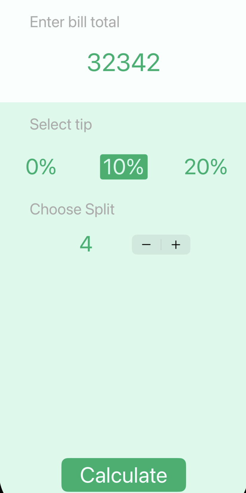
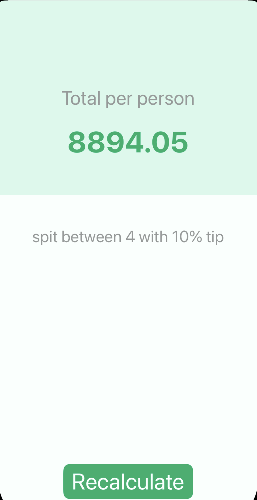

# 💸 Tipsy  

**tip calculator app**
Enter the total bill, select the number of people, choose a tip percentage, and Tipsy will calculate how much each person should pay.  

---

## ✨ Features  
- 🔢 **Bill Splitter** — Divide the total bill among 2, 3, or more people  
- 💰 **Tip Percentage Selection** — Choose how much tip to add (0%, 10%, 20%, etc.)  
- 🧮 **Automatic Calculation** — Instantly shows each person’s share  
 
---

## 📱 Screenshots  

  
  

  

---

## 🛠️ Technologies Used  
- **Swift (UIKit)**  
- **MVC Design Pattern**  
- **Basic Math & Logic in Swift**  
- **Segues for Screen Navigation**  

---

